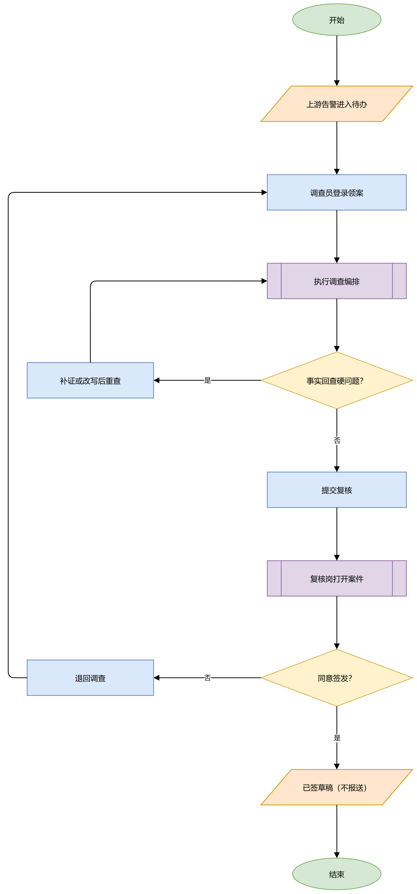
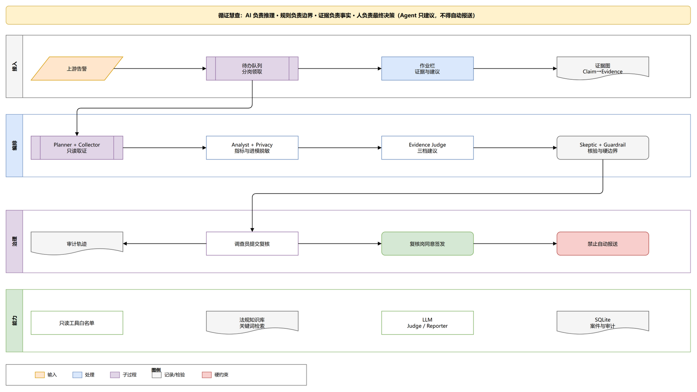
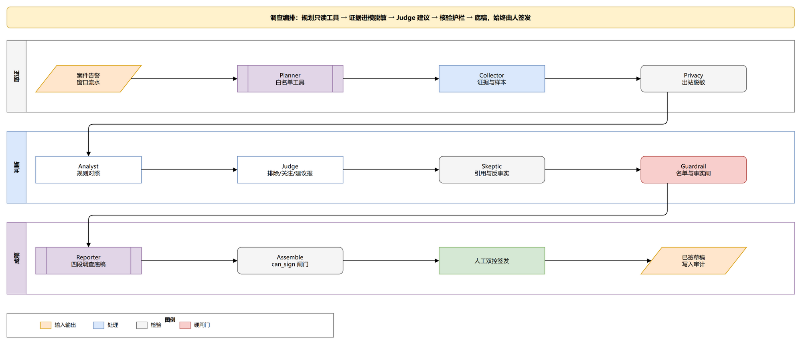

# 循证慧查 · 商业计划书

**AI 负责推理，规则负责边界，证据负责事实，人负责最终决策。**

第十七届「工行杯」全国大学生金融科技创新大赛 · 金融安全服务方向
版本：V3.0（竞赛/研究原型）｜日期：2026 年 9 月
数据性质：本地合成数据，不对接银行核心，不使用真实客户信息

> **口径声明（全篇适用）**：本作品为竞赛/研究原型，全部实验数字为合成数据集上的机制对照，**不是生产调查准确率**；人效对照实验未完成，全篇不出现效率提升百分比。文中所有外部数据均标注来源，见文末「来源与参考文献」。

---

## 1. 项目摘要（我们到底做什么？）

上游交易监测系统已经产生告警。**循证慧查不替代检测**，只接管检测之后人力最密的环节——「告警 → 调查取证 → 写报告 → 人审签发」：把告警升级为案件，由受控多智能体流水线只读取数、提取事实指标、脱敏后交 AI Judge 研判，输出**带证据编号**的三档建议（排除 / 继续观察 / 建议上报）与完整四段调查底稿，经 Skeptic 引用核验与政策护栏后，**由调查员、复核岗双人签发**；Agent 只能建议进入上报复核，永远不能自动报送。

监管锚点：产品机制直接对应国家金融监督管理总局**金发〔2026〕8号**《关于银行业保险业人工智能安全开发应用的指导意见》的核心要求——「谁使用谁负责」、高风险应用人工复核、LLM 出站数据脱敏、全流程可审计（见第 2、6 节）。业务锚点：2024 年修订《反洗钱法》及 2025 年配套规章对可疑交易报告「人工分析、记录过程、排除留痕」的要求。

一句话价值主张：**降补正、留痕迹、控误报**——把调查岗从「从零写报告」变成「改一份证据齐全的底稿」。

---

## 2. 行业背景与痛点（为什么银行需要它？）

### 2.1 监管进入高强度常态化

- 新修订《反洗钱法》（2024 年 11 月 8 日通过，2025 年 1 月 1 日施行）要求金融机构执行可疑交易报告制度，**制定并不断优化监测标准、有效降低误报**，并提高了违法成本——违反反洗钱规定最高可处 1000 万元罚款，或按涉案金额 0.5 至 2 倍罚款（来源：[金融监管总局《反洗钱法》页面](https://www.nfra.gov.cn/cn/view/pages/ItemDetail.html?docId=1199538&itemId=927)、[君合《2025年中国反洗钱立法回顾及评析》](https://www.junhe.com/legal-updates/2874)）。
- 2025 年配套规章密集落地：《金融机构大额交易和可疑交易报告管理办法》（人民银行令〔2018〕第2号，经〔2025〕第10号修改，2025-12-01 施行）、《金融机构客户尽职调查和客户身份资料及交易记录保存管理办法》（人民银行、金融监管总局、证监会令〔2025〕第11号，2026-01-01 施行）、《金融机构客户受益所有人识别管理办法》（人民银行令〔2025〕第12号，2026-01-20 施行）。
- 执法数据：2025 年人民银行系统反洗钱相关罚没合计约 **7.65 亿元**，罚单数量较往年翻倍（机构罚单 519 笔、约 7.44 亿元）；同年金融机构全口径被罚没 31 亿元（含各类违规），其中银行业罚没 24.61 亿元、**同比增长 40.63%**（来源：[2025反洗钱罚单统计](https://zhuanlan.zhihu.com/p/2000509743320560546)、[21财经](https://www.21jingji.com/article/20260107/herald/2b189e3e634b32ad11075f5ed79c143b.html)）。

### 2.2 告警后调查是「人力黑洞」

- 传统规则型交易监测告警中约 **90%–95% 为误报**（PwC 等公开行业口径），调查岗的主要时间耗在排除误报上。
- 报送可疑交易报告约占银行反洗钱合规工作量的 **30%**（来源：[锦天城律所央行205号文实务研究](https://www.allbrightlaw.com/SH/CN/10475/1ff217b886d23bd6.aspx)）。
- 排除告警必须记录合理理由，上报必须写全触发点、资金行为、疑点与理由，要素不全会被限期补正——**瓶颈不是模型分不够高，而是查不完、写不清、留不下痕**。

### 2.3 金发〔2026〕8号：银行用 AI 的边界已经划清

2026 年 6 月 18 日，国家金融监督管理总局印发**金发〔2026〕8号《关于银行业保险业人工智能安全开发应用的指导意见》**，从治理架构、开发应用、数据治理、算力建设、风险管理、能力提升、保障监督七个方面提出 32 项要求（来源：[金融监管总局官网全文](https://www.nfra.gov.cn/cn/view/pages/governmentDetail.html?docId=1261784&itemId=&generaltype=1)、[监管答记者问](https://www.nfra.gov.cn/cn/view/pages/ItemDetail.html?docId=1261708&itemId=917)）。要点包括：

| 8号文要求 | 对银行 AI 应用的含义 |
|---|---|
| 「谁使用谁负责」、自主可控 | AI 辅助做出的决定，责任在金融机构本身；黑箱不能成为免责理由 |
| 高风险应用关键环节建立**人工干预/复核机制** | AI 不能独立完成高风险决策，人机协同是硬要求 |
| 数据治理：分类分级、**数据脱敏**、防数据投毒 | 送入模型的数据必须受控 |
| AI 风险**纳入全面风险管理**、全生命周期管理 | 可审计、可回放、可追责 |

这意味着：**能直接上生产的，恰恰是把这套边界做进产品架构的 AI**，而不是能力更强但不可审计的裸大模型。循证慧查的设计原则与 8号文逐条对应（见第 6 节映射表）——监管越明确，我们的先发位置越清晰。

---

## 3. 用户/业务场景（谁在什么场景下使用？）

**服务对象**：银行反洗钱**调查岗**（一级处置）与**合规复核岗**（二级签发），后台工具，不面向客户。

**场景 1 · 调查岗的日常**：早晨打开待办队列，分岗领取告警。过去一案要跨系统查客户、账户、关联图谱、历史基线，再手工写报告；现在点击「生成调查草稿」，流水线自动完成取数（窗口约 150 笔流水压缩为 ≤30 笔代表样本）、事实指标、证据研判，工作台并排展示「规则对照 / AI Judge / 护栏后建议」三栏，证据编号点击可回溯到原始交易或法规摘录。调查员复核证据、补一句话说明，提交复核。

**场景 2 · 复核岗的把关**：打开案件，看到的是证据链而非一段 AI 黑箱结论：支持证据、反向证据、缺失材料、被护栏拦下的建议都有明示。同意签发 → 生成已签草稿（仍不报送，进入上报复核）；不同意 → 退回调查，全程写入审计轨迹。

**场景 3 · 三档决定都有出口**：批发商户大额频繁（案例 A）→ 经营合理，排除并留痕；退休客户大额转账给未登记亲属（案例 F）→ 继续观察并列缺失材料；短时多层过桥（案例 L，比赛主线）→ 建议上报。系统不是非黑即白的打分器。

---

## 4. 产品方案（慧查到底怎么解决问题？）

**产品形态**：本地可部署的 Case Workspace（案件调查工作台）+ 受控多智能体调查流水线，以 Copilot 方式嵌入现有「告警池 → 调查 → 报送」流程。

**一次调查的完整过程**：

1. **接案**：从告警列表选中一案，告警升级为案件（Case）。
2. **一键生成调查草稿**：规划工具 → 只读取数 → 事实指标 → 进模脱敏 → AI Judge → Skeptic/反事实 → 政策护栏 → 四段全文，全过程 SSE 进度可见。
3. **人在工作台看**：打分拆解、证据图谱（Claim → Evidence → Source）、交易流水、反证、被拒绝的 Claim、法规摘录，**证据编号可点击回溯**。
4. **人做决定**：采纳 / 修改后采纳 / 驳回；双人复核签发。
5. **导出**：Markdown 四段调查底稿（触发点 / 资金行为与疑点 / 反证 / 结论与理由），**明确是底稿不是报文**。

**三档结论与建议动作**（Agent 不得执行报送）：

| 内部标签 | 界面文案 | 系统建议 |
|---|---|---|
| `exclude` | 排除 | 建议关闭（CLOSE），排除理由强制留痕 |
| `observe` | 继续观察 | 建议持续监测（MONITOR），必须列缺失材料 |
| `suggest_report` | 建议上报 | 建议进入上报复核（REPORT_REVIEW），须人签 |

**人机分工**（回答「AI 替人担责吗」）：

| 角色 | 做什么 | 不做什么 |
|---|---|---|
| Agent 流水线 | 规划只读工具、收集证据、规则对照、研判、质疑、写草稿 | 不写核心数据、不自动报送、不改最终监管结论 |
| AI Judge | 在证据约束下输出三档建议、支持/反向/缺失证据、行动项 | 无引用、假引用或事实冲突的输出不得签发 |
| 规则护栏 | 名单命中不得直接排除、事实回查失败不得签发 | 只否决或升级，不与 AI 加权合成 |
| 调查员/复核岗 | 确认、修改或驳回，对签发负责 | — |

---

## 5. AI 技术架构（AI 到底做了什么？）

**九段显式流水线**（`backend/app/pipeline/stages/`，每段职责与禁令在代码中固化）：

| 角色 | 职责 | 禁止 |
|---|---|---|
| Planner | 按告警类型规划白名单内只读工具子集 | 不打分、不报送 |
| Collector | 按告警窗口取全量流水，**确定性规则**抽 ≤30 笔代表样本与簇汇总 | 编造事实；**不得由模型决定抽哪笔** |
| Privacy | 进模前姓名→`CLIENT_001`、账号→`ACCOUNT_001`、客户号→`CUST_001`，出站检漏，漏脱敏即中止 | 把明文 PII 发给模型 |
| Analyst | 从流水/KYC/图谱计算事实指标，形成规则对照 `rule_baseline` | 把上游告警标签计分 |
| Evidence Judge | 输出 `disposition / confidence / 支持证据 / 反向证据 / 缺失材料 / 逐条理由 / 行动项`，每条理由必须引用本轮合法证据编号 | 引用工具范围外事实 |
| Skeptic | 逐条校验引用；移除模型声称的关键证据**重跑反事实**，检查结论是否连贯变化 | 放行失败建议 |
| Policy Guardrail | 执行名单、事实完整性等不可绕过硬边界 | 与 AI 评分加权 |
| Reporter | 基于已校验建议生成四段底稿，事实不一致定向修复一次 | 自动上报 |
| Assemble | `can_sign` 闸门：全部校验通过才允许人工签发 | 跳过闸门 |

**AI 的真实分工**：研判（Judge）与写稿（Reporter）走大模型；取证抽样、指标计算、对照基线是**确定性规则**——「模型只看见样本、基线来自窗口全量」，既控制上下文规模又保证基线可复现。LLM 输出被截断或非 JSON 时先带针对性提示重试一次，再降级到规则对照；截断输出不写缓存。`confidence` 字段显式标记为 `llm_self_assessed_not_calibrated`（模型自评把握度，非校准概率）。

**技术栈**：后端 Python 3.12 + FastAPI + SQLAlchemy（SQLite/可换 PostgreSQL）；前端 React 18 + Vite + Ant Design 5；LLM 经阿里云百炼兼容 OpenAI 的 Chat Completions 接入（可配置 DeepSeek/智谱/本地模型，标准库直调、可缓存脱敏后上下文）；SSE 推送调查进度；知识库为法规章节 + 类型学库，关键词 + 字符 TF-IDF 混合检索（**不是**向量库，如实标注）；21 个 pytest 测试文件 + GitHub Actions CI。 Judge 可在白名单内最多两轮只读补证（`HUICHA_JUDGE_TOOLS`，默认关）。

---

## 6. 核心创新与技术壁垒（和普通规则系统 / LLM 有什么区别？）

### 6.1 六项创新（均可在 Demo 或代码中指出）

1. **环节创新**：做检测下游的调查 Copilot。监测系统回答「疑不疑」，我们回答「**为什么、证据在哪、报告怎么写**」——与检测类产品上下游互补而非对打。
2. **判断可审计（Evidence Judge）**：结构化契约输出三档建议与证据引用；未知编号、无引用理由、建议上报但无支持证据 → **整份建议校验失败并阻断签发**。
3. **Skeptic 反事实核验**：移除模型声称的关键证据后重跑，验证结论是否因证据变化而连贯变化——对 LLM「换个说法结论不变」的确认偏误做机制性对抗。
4. **规则与 AI 不加权**：规则对照独立展示供人裁决，政策护栏（名单命中不得直接排除、事实回查失败不得签发）只否决或升级——避免了「AI 分数洗白规则误报」的行业通病。
5. **先安全再智能**：工具白名单只读、每次调用入审计、LLM 出站脱敏+出站二次拦截、双人签发、导出留痕。
6. **事实回查**：对报告全文正则抽取交易号/账号/金额与工具返回事实表比对，草稿中出现工具结果里没有的账号/编号会被拦截（现场可演示虚构账号 `6222-FAKE-9999` 被标红不可签发）。

### 6.2 与金发〔2026〕8号的逐条映射——「合规即产品」

| 金发〔2026〕8号 要求 | 循证慧查 已落地的机制 |
|---|---|
| 谁使用谁负责 | Agent 只建议、人签发；签发人与修改记录入审计轨迹 |
| 高风险应用人工干预/复核机制 | 调查员提交 → 复核岗签发的**双控流程**（图 1） |
| 数据脱敏、分类分级 | `privacy_v2`：仅 LLM 出站脱敏 + `assert_clean` 检漏 + `chat()` 出站二次拦截；缓存只存脱敏后上下文哈希 |
| 全生命周期管理、可审计 | 每次工具调用写 `tool_trace` 与 AUDIT 日志，调查过程可回放 |
| 防数据投毒 / 输入受控 | 只读工具白名单，模型只见确定性规则抽取的样本与簇代表 |
| 供应链自主可控 | LLM 可配置替换（百炼/DeepSeek/智谱/stub，生产可切行内私有化模型），产品逻辑不绑定单一供应商 |

大多数团队的合规是「答辩时口头承诺」，我们把合规边界做成**代码里的闸门**——这是本作品区别于「通用大模型 + 提示词」方案的根本结构差异，也是壁垒所在：证据契约协议、反事实核验器、护栏引擎、审计回放都是可迁移、可对外讲述的工程资产。

### 6.3 差异化对照

| 对比对象 | 他们 | 循证慧查 |
|---|---|---|
| 规则/模型监测系统（含检测类作品） | 提高检出、降告警量 | 接受已有告警，做调查与报告 |
| 通用大模型直接生成结论 | 易幻觉、不可审计 | 只读工具 + 引用契约 + 反事实 + 护栏 + 人签 |
| 传统人工调查手册 | 人查人写 | 同样的监管要素，Agent 填初稿、人审定 |
| 规则引擎类「智能调查」 | 规则打分定结论 | 规则只做对照与硬边界，判断由证据约束的 AI 给出 |

---

## 7. 效果验证（凭什么证明有效？）

**总口径（必须先读）**：以下数字验证「证据 Judge + 规则对照 + 硬护栏 + 事实回查」流水线的**机制有效性**，均在合成数据集上测得，**不是生产调查准确率**；Agent 建议须经调查员签发（完整口径见仓库 `experiments/RESULTS.md`、`REAL_MODEL_REPORT.md`）。

### 7.1 机制验证（可复现，stub Judge）

| 指标 | 结果 | 说明 |
|---|---|---|
| 事实回查拦截率（毒化草稿 n=200） | **100%** | 测的是回查机制本身，不经大模型 |
| 干净文本误报率（n=200） | **0%** | 「约 5 万元阈值」等合规概数措辞不被误杀 |
| 引用契约通过率 | **100%** | 逐条理由的证据编号均属本案 |
| 关键证据反事实覆盖率 | 59.8% | 反事实核验机制覆盖的样本比例 |
| 幻觉演示账号拦截 | 通过 | 工作台开关可现场复现 |

### 7.2 独立合成集上的真实模型消融（同一模型，唯一变量是 prompt 标准）

- **开发集 v3**（n=240，11 个叙事族，真实调用百炼 `deepseek-v4-flash`）：`judge_v2` Macro-F1 **0.39** → `judge_v3` **0.97**——证明「把三档可操作判定标准写进证据契约」带来决定性差异（来源：仓库 `experiments/REAL_MODEL_REPORT.md`，2026-09-12）。
- **盲测保留集**（n=220，独立盲集，`judge_v4`）：Macro-F1 **0.994**（混淆矩阵：排除 80/80、观察 39/39、建议上报 95/96，唯一误差为观察→上报的保守边界）；`verify` 引用校验通过率 1.0；证据支持侧查准/查全 0.777/0.967；基线 `always_report` 仅 0.208（来源：仓库 `experiments/RESULTS.md`，2026-09-13）。
- 实验报告同时如实记录了限制：v1/v2 数据集因标签泄漏已降级；v3 判定标准例举的类型学与测试叙事族高度重合，读数是条件乐观估计，**例举之外类型学需另行 hold-out**。

### 7.3 工程质量

21 个后端 pytest 测试文件（含双控、隐私、审计、采样器、独立基准集协议）+ 前端 5 个测试脚本，GitHub Actions CI（Python 3.12 测试 + Node 20 构建）。

### 7.4 诚实边界（我们主动声明）

人效对照（教室实验）与外部专家盲评**未完成**，协议已就绪（`experiments/HUMAN_STUDY.md`），完成前不写「效率提升 xx%」；当前全部为合成数据，真实脱敏 hold-out 是 P0 待办。

---

## 8. 落地与商业模式（工行能不能真正用？）

**落地路径（三阶段，后两阶段为方案层、原型未做）**：

1. **竞赛/研究期（当前）**：合成数据工作台，机制与 Demo 已闭环。
2. **行内试点（方案）**：**只读**对接告警队列与客户/交易查询服务，权限继承现有调查岗体系；数据不出域，LLM 切换行内私有化模型或行内智能算力网关；仍禁止自动报送。试点期并行完成人效对照与专家盲评（P0）。
3. **推广期（方案）**：PostgreSQL 集群、法规版本治理（规章修订自动进入知识库并标注版本）、岗位复核流配置化、与 STR 填报系统的「草稿回填」（仍须人点报送）。

**为什么落地阻力小**：不改监测引擎、不碰核心写权限、不要求更换现有反洗钱系统——以「按案件出草稿」的方式嵌入现有流程，调查岗的账怎么查、复核岗的章怎么盖都不变，只是初稿从「从零写」变成「改稿」。

**收费模式（技术侧承诺的计费锚点）**：按**签发案件数**计使用，而不是按检出条数与监测引擎抢预算——与「降补正、留痕迹」的价值一致。可叠加：试点期项目制（部署 + 知识库本地化 + 人效评估），推广期年费订阅 + 签发量阶梯。

**与工行的结合点**：大型股份行调查岗规模大、告警基数高，是「查不完」问题最尖锐的场景；8号文实施后，行内引入任何调查 AI 都需要过「谁使用谁负责 + 人工复核 + 脱敏 + 审计」四道关——本产品的机制设计即为这四道关而生，可作为行内「可信 AI 应用」的合规样板间。

**风险与应对**（要点）：结论错误/确认偏误 → 双控签发 + Skeptic + 反事实；模型幻觉 → 引用契约 + 事实回查 + 不可签发；数据隐私 → 出站脱敏 + 数据不出域部署方案；把实验读数误用 → 全套口径声明与禁语清单随产品交付。

---

## 9. 市场与竞争分析（为什么需要你们？）

**需求侧确定性**：反洗钱是监管硬约束，处罚金额在翻倍式增长（2025 年人行系统反洗钱罚没 7.65 亿元），新《反洗钱法》明确要求优化监测标准、降低误报——「告警后调查提效」是每一家持牌机构的刚性支出，不是可选项。

**竞争格局**：

- **交易监测厂商**（规则引擎/机器学习检测）：在「疑不疑」赛道竞争，与我们是上下游关系，存在合作空间而非替代关系。
- **咨询/合规服务**：输出制度与流程，不产出可部署的软件资产；我们的流水线本身是可复现的工程资产。
- **通用大模型方案**：能力演示惊艳，但「假引用无法发现、幻觉不可拦截、责任无法落人」在 8号文框架下不可上生产；我们的证据契约 + 双控签发正是其缺失的部分。

**为什么是「我们」**：学生团队的劣势在渠道与生产经验，优势在**设计自由度**——从第一行代码就把「人签发、证据可溯、护栏不可绕过」作为架构约束，而不是在成品外面补合规补丁。机制层（证据契约协议、反事实核验、护栏引擎）均有实验与测试覆盖，代码、文档、实验报告全部开源在仓库内可查证。

---

## 10. 团队与实施计划（谁来做、怎么落地？）

**团队分工**（按现有仓库贡献与答辩分工）：

| 角色 | 职责 | 现状 |
|---|---|---|
| 算法/实验 | Judge 契约与 prompt 消融、benchmark 协议、盲集 holdout | 已交付 v2→v3→v4 消融与两份实验报告 |
| 后端工程 | Pipeline、隐私、护栏、审计、API 与测试 | 76 个 Python 模块，21 个测试文件 |
| 前端/演示 | 案件工作台、证据图谱回溯、比赛演示动线 | React 工作台 + 3 分钟演示脚本 |
| 商业/合规 | 法规映射、商业计划、答辩口径 | 本计划书 + 答辩作战手册 |
（成员姓名按最终报名名单填写）

**实施里程碑**：

- **T0（竞赛期，当前）**：机制闭环 + 合成集消融 + 双控演示 → 大赛提交与答辩。
- **T+3 月**：完成人效对照实验与外部专家盲评（`HUMAN_STUDY.md` 协议就绪）；真实脱敏 hold-out 数据集建设。
- **T+6 月**：行内试点方案落地——只读告警队列对接、私有化模型切换、法规版本治理（P1 权限模型）。
- **T+12 月**：试点行验证报告 → 推广期产品化（PostgreSQL、复核流配置化、STR 草稿回填）。

**下一步技术优先级**（P0 → P2）：人效对照与盲评 → 法规版本治理与权限模型 → 只读对接告警队列。

---

## 来源与参考文献

**监管文件与官方页面**

1. 国家金融监督管理总局：《关于银行业保险业人工智能安全开发应用的指导意见》（金发〔2026〕8号，2026-06-18 印发）——[官网全文](https://www.nfra.gov.cn/cn/view/pages/governmentDetail.html?docId=1261784&itemId=&generaltype=1)、[官网条目页](https://www.nfra.gov.cn/cn/view/pages/ItemDetail.html?docId=1261784&itemId=928)、[监管答记者问](https://www.nfra.gov.cn/cn/view/pages/ItemDetail.html?docId=1261708&itemId=917)
2. 《中华人民共和国反洗钱法》（2024-11-08 修订，2025-01-01 施行）——[金融监管总局页面](https://www.nfra.gov.cn/cn/view/pages/ItemDetail.html?docId=1199538&itemId=927)
3. 《金融机构大额交易和可疑交易报告管理办法》（人民银行令〔2018〕第2号，经〔2025〕第10号修改，2025-12-01 施行）；《金融机构客户尽职调查和客户身份资料及交易记录保存管理办法》（人民银行、金融监管总局、证监会令〔2025〕第11号，2026-01-01 施行）；《金融机构客户受益所有人识别管理办法》（人民银行令〔2025〕第12号，2026-01-20 施行）——条文转述见仓库 `huicha-aml/backend/app/knowledge_ctr.py`、`knowledge_cdd.py`、`knowledge_ubo.py`

**行业数据与解读**

4. 2025 年反洗钱罚没统计（约 7.65 亿元、罚单翻倍）——[知乎专栏统计文](https://zhuanlan.zhihu.com/p/2000509743320560546)、[捷软世纪季度分析](http://www.agilecentury.com/show_1_52_542.html)
5. 2025 年金融机构被罚没 31 亿元、银行业 24.61 亿元（+40.63%）——[21财经](https://www.21jingji.com/article/20260107/herald/2b189e3e634b32ad11075f5ed79c143b.html)
6. 新《反洗钱法》罚则幅度（最高 1000 万元 / 涉案金额 0.5–2 倍）——[君合《2025年中国反洗钱立法回顾及评析》](https://www.junhe.com/legal-updates/2874)
7. 可疑交易报告约占合规工作量 30% ——[锦天城律所：央行205号文实务研究](https://www.allbrightlaw.com/SH/CN/10475/1ff217b886d23bd6.aspx)
8. 传统规则型监测告警误报率约 90%–95% ——PwC 等公开行业口径（转引自仓库《循证慧查-技术文档》第 2.1 节）

**项目内证**（本仓库）

9. `huicha-aml/README.md`（产品与机制总说明）；`循证慧查-技术文档（供商业计划最终报告）.md`（技术事实源）；`答辩作战手册.md`（口径与禁语）
10. `huicha-aml/experiments/RESULTS.md`、`experiments/REAL_MODEL_REPORT.md`（全部实验数字与口径）；`experiments/HUMAN_STUDY.md`（人效实验协议，未完成）
11. 图片来源：仓库 `huicha-aml/figures/`（fig_flow_biz.png、fig_roadmap.png、fig_pipeline.png，均为本项目自制示意图）
